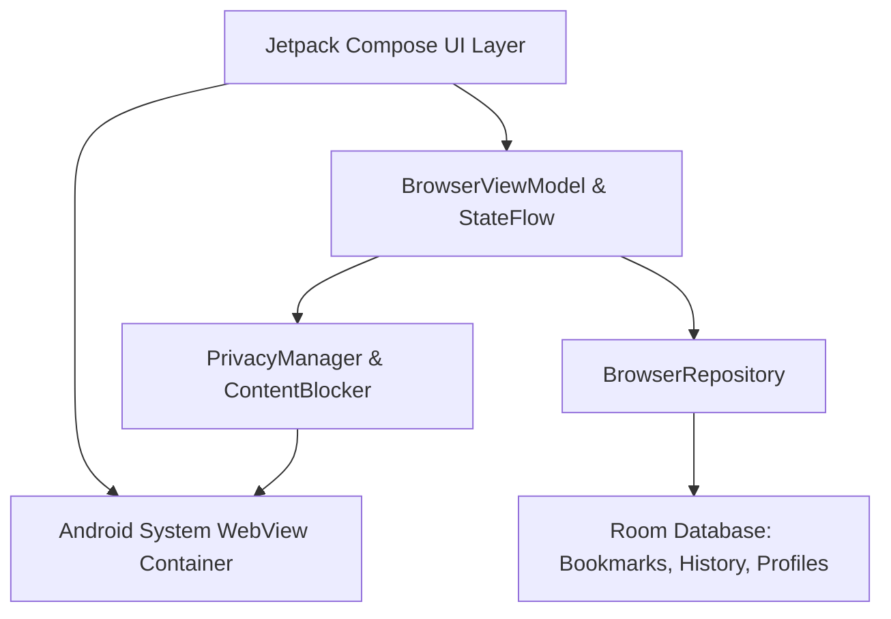

<div align="center">

# 🌐 Material Privacy Browser for Android

<p align="center">
  <strong>A lightning-fast, ultra-lightweight, and privacy-first Android web browser built with Jetpack Compose & Material You (M3).</strong>
</p>

[](https://github.com/Likhon545466/lightweight_browser/releases/latest)
[](https://github.com/Likhon545466/lightweight_browser/actions)
[-3DDC84?style=for-the-badge&logo=android&logoColor=white)](https://www.android.com/)
[](https://kotlinlang.org/)
[](https://developer.android.com/jetpack/compose)
[](LICENSE)

<br />

[📥 Download Latest APK](https://github.com/Likhon545466/lightweight_browser/releases/latest) • [✨ Key Features](#-key-features) • [🛠️ Architecture](#-architecture--tech-stack) • [🚀 Building from Source](#-building-from-source) • [🤝 Contributing](#-contributing)

---

</div>

## 📖 Overview

**Material Privacy Browser** is an open-source, resource-efficient web browser engineered for privacy and performance. Designed from the ground up using modern **Jetpack Compose** and **Material Design 3**, it delivers a seamless, native Android experience with dynamic theme integration (Material You), custom multi-profile isolation, zero-overhead ad/tracker blocking, and strict ephemeral private browsing.

---

## ✨ Key Features

| Feature | Description |
| :--- | :--- |
| 🛡️ **Native Ad & Tracker Blocker** | Inbuilt zero-overhead request interceptor that blocks advertising networks, telemetry beacons, and behavioral analytics scripts without external add-ons. |
| 🎨 **Material You & AMOLED Dark Mode** | Dynamic wallpaper-based color palette generation on Android 12+, with Light, Dark, and true Pitch-Black (`#000000`) AMOLED modes to save battery. |
| 👥 **Multi-Profile Isolation** | Separate workspaces (e.g. Work, Personal, Finance) with completely isolated cookies, cache, bookmarks, and browsing history. |
| 🕵️ **Ephemeral Incognito Mode** | One-tap private tabs that automatically wipe cache, session cookies, and temporary data upon closing. |
| ⚡ **Fluid & Snappy UI** | Optimized 160ms fast-out-slow-in animations, predictive back gestures, and zero black-flash page transitions. |
| 🔍 **Multi-Engine Search Selector** | Quick switching between privacy-oriented and major search providers (Google, DuckDuckGo, Bing, Brave Search). |
| 🔒 **HTTPS Enforcement & Cookie Toggles** | Strict security controls, mixed-content blocking, and granular 3rd-party cookie preferences. |
| 📱 **Desktop Mode & Find in Page** | Instant User-Agent switcher for full desktop sites, plus live in-page text search with match counts and navigation. |
| 📑 **Visual Tabs Manager** | Interactive tab switcher sheet with thumbnail previews, tab counts, and swift swipe-to-dismiss. |
| 💾 **Local Bookmarks & Downloads** | Fast SQLite/Room persistence for bookmark organization, history tracking, and native download management. |

---

## 🛠️ Architecture & Tech Stack



- **Language:** 100% [Kotlin](https://kotlinlang.org/) with Coroutines & StateFlow
- **UI Framework:** [Jetpack Compose](https://developer.android.com/jetpack/compose) with Material Design 3 (M3)
- **Web Rendering:** Android System WebView with AndroidX WebKit extensions
- **Database & Persistence:** [Room Database](https://developer.android.com/training/data-storage/room) with SQLite
- **Architecture Pattern:** MVVM (Model-View-ViewModel) + Unidirectional Data Flow (UDF)
- **Testing:** JUnit 4, Robolectric, and Compose UI Test Framework
- **Automation & CI/CD:** GitHub Actions (Build verification & automated release packaging)

---

## 📁 Project Structure

```
lightweight_browser/
├── .github/
│   ├── ISSUE_TEMPLATE/       # GitHub Issue templates
│   └── workflows/
│       ├── ci.yml            # CI build and test automation
│       └── release.yml       # Automated GitHub Release builder
├── app/
│   ├── src/
│   │   ├── main/
│   │   │   ├── java/com/example/
│   │   │   │   ├── browser/       # ViewModels, State & Models
│   │   │   │   ├── data/          # Room Database, DAOs & Repositories
│   │   │   │   ├── privacy/       # ContentBlocker & PrivacyManager
│   │   │   │   └── ui/            # Compose screens, components & M3 theme
│   │   │   └── res/               # Vector drawables, themes, mipmaps & strings
│   │   └── test/                  # Unit and Robolectric test suites
│   └── build.gradle.kts      # Application build configuration
├── gradle/                   # Gradle wrapper and version catalog (libs.versions.toml)
├── CHANGELOG.md              # Version release history
├── CONTRIBUTING.md           # Contribution guidelines
├── CODE_OF_CONDUCT.md        # Community code of conduct
├── LICENSE                   # MIT License
├── README.md                 # Project documentation
└── settings.gradle.kts       # Gradle project settings
```

---

## 🚀 Building from Source

### Prerequisites
- **JDK:** OpenJDK 17 or OpenJDK 21
- **Android Studio:** Hedgehog (2023.1.1) / Ladybug or newer
- **Android SDK:** Platform 34+ (Android 14 / Android 15 ready)

### Clone & Build
```bash
# 1. Clone the repository
git clone https://github.com/Likhon545466/lightweight_browser.git
cd lightweight_browser

# 2. Run Unit Tests
./gradlew test

# 3. Assemble Debug APK
./gradlew assembleDebug
# Output: app/build/outputs/apk/debug/app-debug.apk

# 4. Assemble Release APK
./gradlew assembleRelease
# Output: app/build/outputs/apk/release/app-release.apk
```

### Signing Configuration (Optional)
To sign release builds with your custom upload keystore, provide the following environment variables:
```bash
export KEYSTORE_PATH="/path/to/your/keystore.jks"
export STORE_PASSWORD="your-store-password"
export KEY_ALIAS="your-key-alias"
export KEY_PASSWORD="your-key-password"
./gradlew assembleRelease
```
*If no keystore is provided, the build gracefully signs with standard debug keys for local testing.*

---

## 🔒 Permissions & Privacy Transparency

This browser only requests permissions strictly essential for browsing functionality:

| Permission | Purpose |
| :--- | :--- |
| `android.permission.INTERNET` | Required to fetch and load web pages requested by the user. |
| `android.permission.ACCESS_NETWORK_STATE` | Used to detect offline states and trigger automatic network reconnects. |

> **Privacy Guarantee:** No user data, URLs, search queries, or device telemetry are ever collected, transmitted, or sold. All browsing history, cookies, and bookmarks stay 100% local on your device.

---

## 🤝 Contributing

Contributions, bug reports, and feature suggestions are welcome!
1. Check the [Contributing Guide](CONTRIBUTING.md) for instructions on setting up your environment.
2. Read the [Code of Conduct](CODE_OF_CONDUCT.md).
3. Open a [Pull Request](https://github.com/Likhon545466/lightweight_browser/pulls) or file an [Issue](https://github.com/Likhon545466/lightweight_browser/issues).

---

## 📄 License

This project is licensed under the **MIT License** - see the [LICENSE](LICENSE) file for details.
